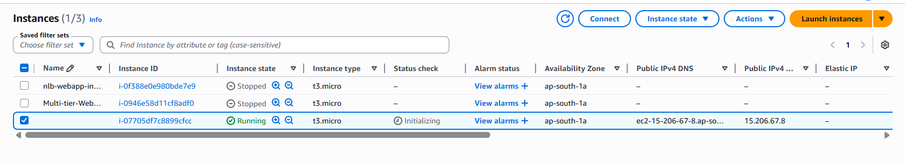
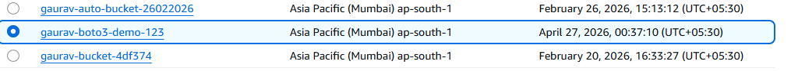
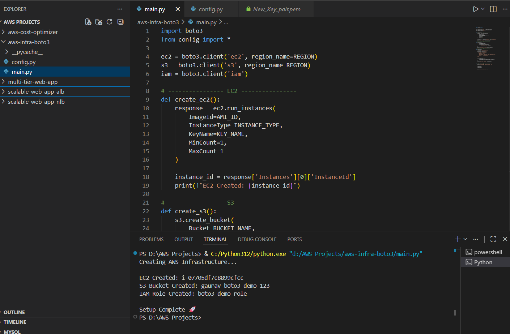

# 🚀 AWS Infrastructure Automation using boto3

## 📌 Overview

This project automates AWS infrastructure creation using Python and boto3 without manually using the AWS Console.

The script automatically provisions:

* EC2 instance
* S3 bucket
* IAM role

This demonstrates Infrastructure as Code (IaC) concepts using the AWS SDK for Python.

---

# 🧰 AWS Services Used

* Amazon EC2
* Amazon S3
* AWS IAM
* boto3 (AWS SDK for Python)

---

# 🏗️ Architecture

```text
Python Script
      ↓
    boto3
 ┌─────────────┬─────────────┬
 ↓             ↓             ↓
EC2           S3            IAM
```

---

# ⚙️ Features

✅ Automated EC2 creation
✅ Automated S3 bucket creation
✅ IAM role automation
✅ Infrastructure provisioning using Python
✅ No manual AWS Console operations

---

# 💻 Python Automation Script

```python
import boto3

ec2 = boto3.client('ec2')
s3 = boto3.client('s3')
iam = boto3.client('iam')

# Example EC2 creation
response = ec2.run_instances(
    ImageId='ami-xxxxxxxx',
    InstanceType='t2.micro',
    MinCount=1,
    MaxCount=1
)

print("EC2 Instance Created")
```

---

# ⚙️ Setup Steps

## 1️⃣ Install boto3

```bash
pip install boto3
```

---

## 2️⃣ Configure AWS Credentials

```bash
aws configure
```

Enter:

* AWS Access Key
* AWS Secret Key
* Region

---

## 3️⃣ Run Script

```bash
python main.py
```

---

# 📸 Screenshots

## 🔹 EC2 Instance Created



---

## 🔹 S3 Bucket Created



---

## 🔹 Implementation



---

# 📊 Results

✅ Infrastructure created automatically
✅ Faster deployment process
✅ Reduced manual configuration
✅ Reproducible cloud setup

---

# 💡 Key Learnings

* AWS SDK automation using boto3
* Infrastructure as Code concepts
* AWS resource provisioning
* IAM role management
* Cloud automation scripting

---

# 🚀 Future Improvements

* Add VPC automation
* Add Security Groups
* Add Load Balancer creation
* Add Auto Scaling setup
* Convert to Terraform

---

# 📂 Project Structure

```text
aws-infra-boto3/
│── main.py
│── config.py
│── requirements.txt
│── README.md
│── screenshots/
│     ├── 1.png
│     ├── 2.png
│     └── 3.png
```

---

# 🔗 GitHub Commands

```bash
git add .
git commit -m "AWS Infrastructure Automation using boto3"
git push
```

---

# 🎯 Interview Summary

> Built an AWS infrastructure automation project using Python and boto3 to provision EC2, S3, and IAM resources programmatically, reducing manual cloud setup effort and demonstrating Infrastructure as Code concepts.

---
